# Serverless CI/CD with AWS

- [Overview](#overview)
- [Hands On](#hands-on)
    - [Logging in to AWS Console](#logging-in-to-aws-console)
    - [Creating the Pipeline](#creating-the-pipeline)
    - [Define the Source](#define-the-source)
    - [Define the Build](#define-the-build)
    - [Observe the failure](#observe-the-failure)
    - [Fix the build!](#fix-the-build)
    - [Re-run the pipeline](#re-run-the-pipeline)
    - [Add a new stage](#add-a-new-stage)
    - [Add a generate changeset action](#add-a-generate-changeset-action)
    - [Add an execute changeset action](#add-an-execute-changeset-action)
    - [Re-run the pipeline again](#re-run-the-pipeline-again)
    - [This is what success looks like!](#this-is-what-success-looks-like)
    - [Verify the deployment](#verify-the-deployment)
    - [Commit a change!](#commit-a-change)
    - [Verify the change!](#verify-the-change)
- [Conclusion](#conclusion)
- [One more thing...](#one-more-thing)

# Overview
Serverless is fast becoming the new default compute model for many software projects. The attractive pay as you go pricing model, rapid scaling and reduced ops overhead are very compelling advantages to any organisation shipping software.

While applications are moving to this new compute model, we're often still left with some traditional infrastructure in the form of build servers and nodes. This remains a burden for ops due to having to perform OS patching, build server updates and managing fleets of build nodes as well as monitoring for performance and right-sizing both server and build nodes on an ongoing basis. This leaves also a potential single point of failure where build servers are shared amongst different services being deployed - downtime of the server/nodes can mean delays in shippinh. 

In this playground we're going to remove some of that burden by creating a serverless CI/CD pipeline on AWS using CodePipeline, CodeBuild and CloudFormation. This pipeline will be deploying a simple nodejs express application to lambda.

# Hands On

### Logging in to AWS Console
You can skip this section if you are using your own AWS account and have appropriate IAM access (detailed in addendum)

First we need to login to the console (credentials provided separately) - also ensure that we are in the eu-west-1 region.
https://ecsd-training.signin.aws.amazon.com/console

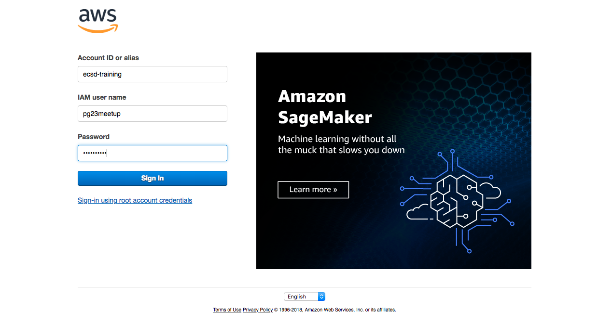

The user that we logged into won't have many permissions at this stage so we need to assume an appropriate role. Follow this link in order to do that

https://signin.aws.amazon.com/switchrole?roleName=pg23meetuprole&account=ecsd-training

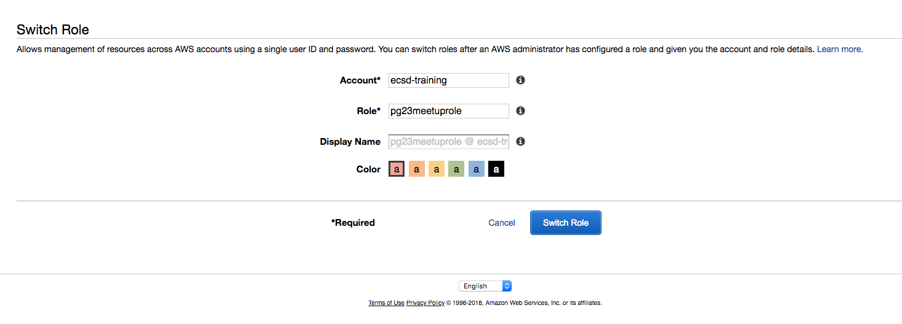

Just click the "Switch Role" button to continue back to the console

You should now see an indicator in the top right showing that you are currently assuming a role.

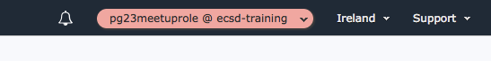

### Creating the pipeline

Next we need to navigate to the CodePipeline user interface.
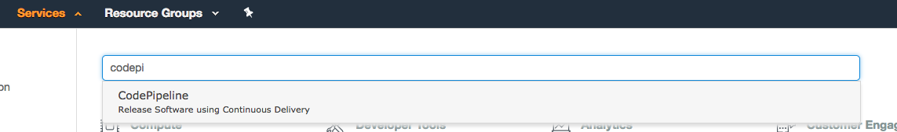

Click the "Create Pipeline" button. If there are no pipelines listed you'll see a getting started screen instead so just click "Get started" to get to the next step

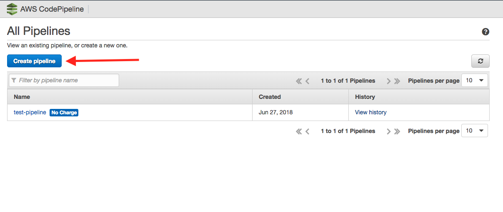

You now need to give your pipeline a name - this needs to be unique so try and follow convention e.g. firstnamelastinitial-pg23-pipeline (e.g. paulf-pg23-pipeline)

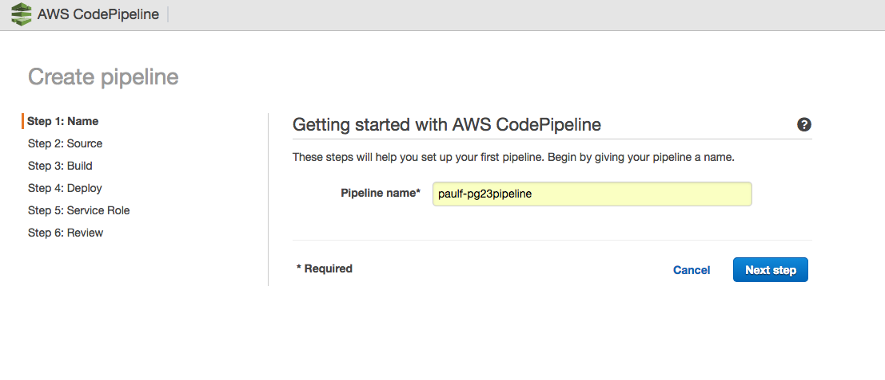

Click the "Next Step" button to continue

### Define the source

The first step in our pipeline is to grab our source code. In our case this is provided in a codecommit repository but other options are available for github and AWS S3. The branch we'll be deploying is the master branch.

Choose CodeCommit.

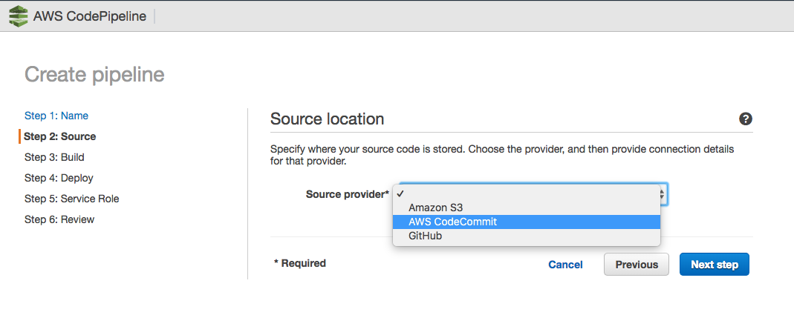

Pick the repository "pg23repo" and the branch master

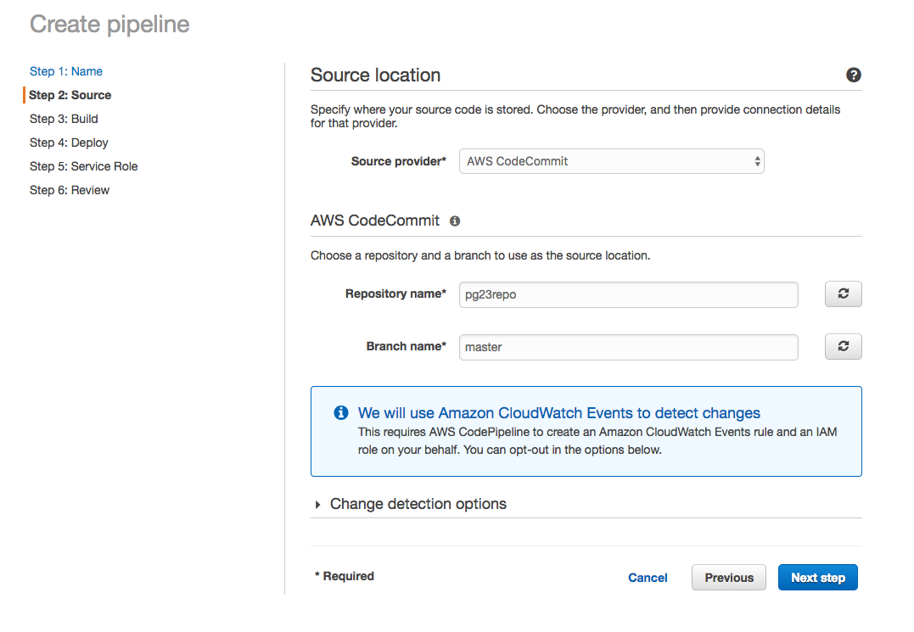

Leave the "Change detection options" at their default - for CodeCommit and s3 this will use CloudWatch events to detect changes in order to trigger the pipeline, github will use webhooks.

Click the "Next Step" button to continue

### Define the Build

Next you need to pick your build provider. This can be a number of different options (some are not shown in the drop down, such as teamcity as these can be defined if you create your codebuild configuration using cloudformation), but for our purposes we're going to use CodeBuild.

A number of additional fields will now appear which will need to be populated in order to create our codebuild configuration.

Firstly we want to "Create a new build project" and fill out the name field

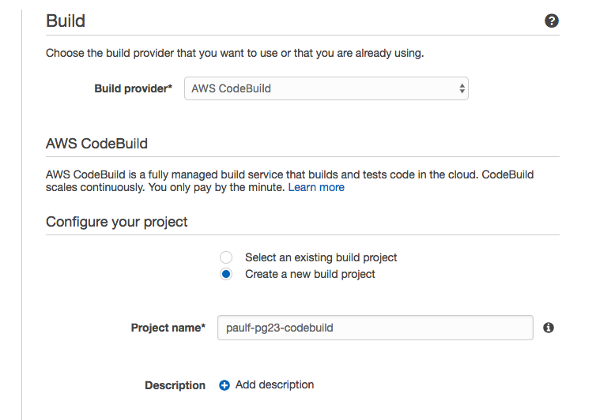

Next we need to define the build environment. This can be achieved by either using an AWS provided CodeBuild container or by specifying a docker image of your choosing from either Amazon ECR or another docker repository.

We are going to use a standard linux ubuntu image with the nodejs10 environment.

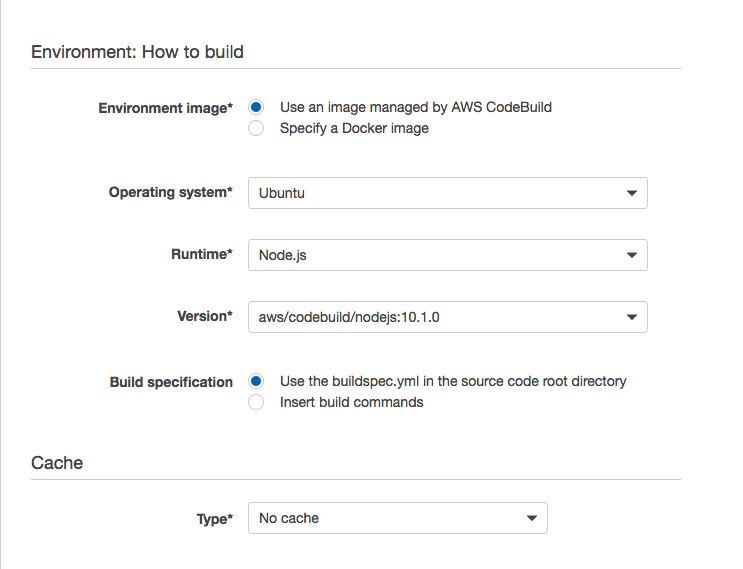

The build specification defines the steps and commands you need to run in order to perform the build (e.g. npm install) as well as defining which artifacts are output from the process to be consumed by subsequent pipeline stages. You can feed parameters into the build spec by using environment variables which are injected into the container at runtime.

For more information on the buildspec see https://docs.aws.amazon.com/codebuild/latest/userguide/build-spec-ref.html

We have provided the buildspec for the project so just leave the "Use the buildspec.yml in the source code root directory" selected, all we're doing in the buildspec is validating and packaging a cloudformation template. 

Also leave the Cache set to "No cache".

Scroll down to the AWS CodeBuild service role section.

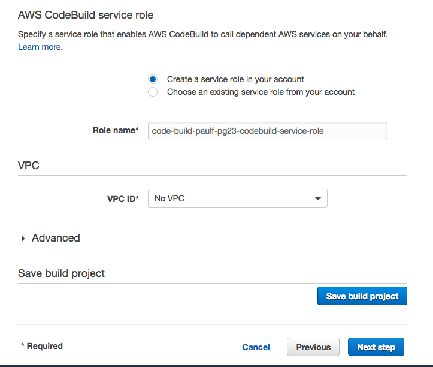

You can choose to either create an IAM role for this build project or re-use an existing one. At the time of writing if you re-use an existing one you can only do so 9 times as each time you re-use it will add an additional policy to the existing role and there's a limit of 10.

For this demo choose "Create a service role in your account", a sensible default name should already be populated but keep note of it for later as we may need additional permissions applied to that role in order to complete the build

No VPC is required for this particular build but if for example you wanted to update the database schema of an RDS instance in a VPC you would need to configure this.

The advanced section we won't be altering but worth talking through some of the options there.

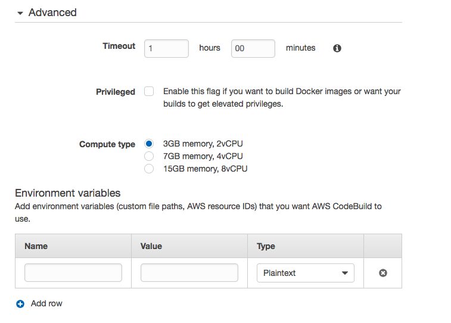

Timeout - How long before you consider your build dead in the water. This is important to reduce cost, set it to something reasonable - too large and you may incur additional cost if a build stalls, too short and your builds may become intermittent especially where access to public artifcats is required (e.g. npm).

Privileged - If you are building docker images using CodeBuild then you need this. Often the use case is that CodeBuild will build and push a docker image and then that is rolled out to ECS using Cloudformation to replace the image on the service.

Compute Type - this determines the performance level of your container and also your cost per build minute.

Environment Variables - these are the variables available within your buildspec execution so if you need to parameterise your build you'd do it in this way.

Click "Save build project". This takes a few seconds as it also has to create the service role.

When creation is complete, hit the "Next step" button

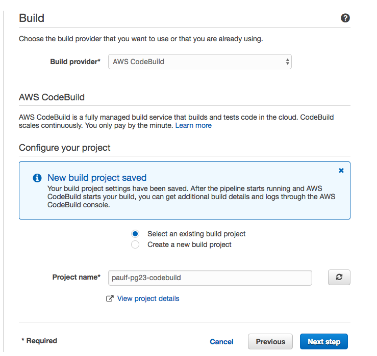

### Skip deployment for now

For now select No Deployment - we'll come back and add this step later.

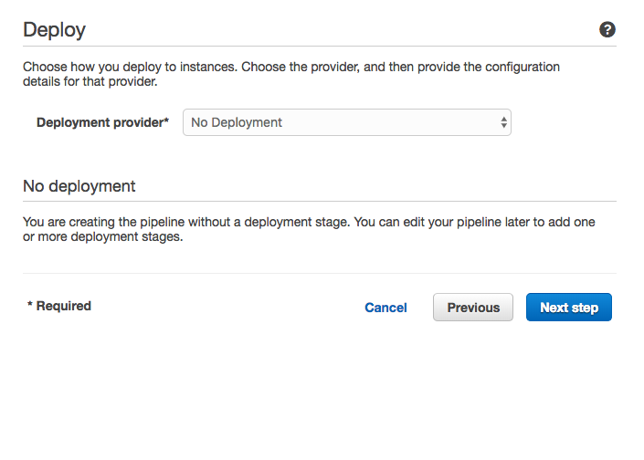

Click "Next step"

### Select a service role

CodePipeline requires a role in order to perform actions. You can either create a new role which will apply a default set of permissions or assume an existing one.

Select the existing "pg23-codepipeline-role" for this example

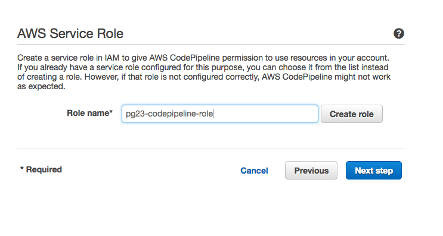

The minimum set of permissions required by the codepipeline role and how you define a custom role is outlined in aws documentation which can be found here https://docs.aws.amazon.com/codepipeline/latest/userguide/how-to-custom-role.html

Click "Next step" to proceed.

### Review the pipeline

The final stage is to review the pipeline settings.

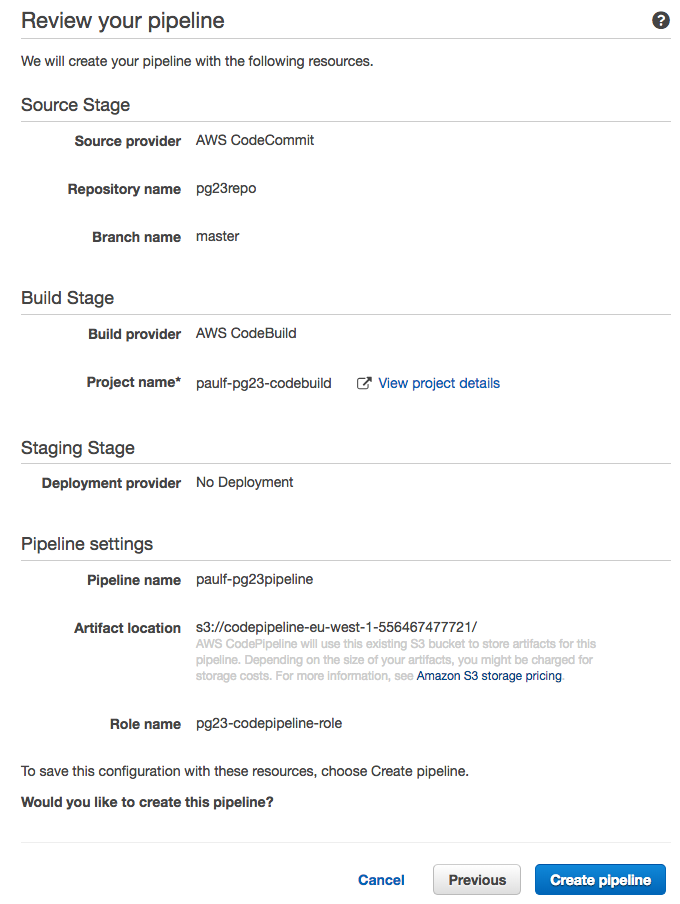

Once you're happy with the settings, click "Create Pipeline"

### Observe the failure

Your pipeline should be triggered on creation but will likely fail at this point

### Fix the build!

The build will have failed as one of the steps requires permission to perform a PutObject request on s3. Let's fix this.

Navigate to the IAM user interface and select Roles on the left.
Find the role you created for your CodeBuild configuration.

Click the "Attach Policy" button.

Type "S3" in the search box.
For this demo let's just assign "AmazonS3FullAccess" - in a real environment you'd define an appropriate policy for your bucket for least privilege. Select the "AmazonS3FullAccess" role by clicking the checkbox to its left.

Click the "Attach Policy" button down the bottom right.

Observe that the Permissions tab now lists "AmazonS3FullAccess" in addition to existing policies.

### Re-run the pipeline

Go back to your pipeline and click the "Release" button. This time the pipeline should succeed and we are ready to define our deployment steps!

### Add a new stage

Deployment of a SAM template needs to consist of two steps as CloudFormation stack creation currently does not support template transforms. 

We instead need to generate a change set and then apply the change set to a new or existing CloudFormation stack.

This will require two pipeline actions.

First, lets add a new stage to the pipeline

In your pipeline, click the "Edit" button.

You will see the UI change to show additional controls which allow you to modify your pipeline's workflow.

### Add a generate changeset action

### Add an apply changeset action

### Re-run the pipeline again

### This is what success looks like!

### Verify the deployment

### Commit a change

### Verify the change

# Conclusion

So now we have a pipeline which can continuously deploy changes from our master branch to our deployment environment. 

Other additions we can make to this pipeline include additional stages (such as uat), manual approval (requiring human intervention in order to continue) as well as other actions such as running tests. 

# One more thing

As a sidenote, CodePipeline and CodeBuild also generate events which can be consumed and fed into CloudWatch as metrics. This can be used to build dashboards showing the performance of your pipeline and development process. This can be a powerful tool in diagnosing issues with your SDLC by examining the various metrics with regards to feedback, failure and deployment rate.

This dashboard was borrowed from Stelligent

https://stelligent.com/2017/11/16/codepipeline-dashboard/
The code can be found here: https://github.com/stelligent/pipeline-dashboard

What interesting metrics can you pick out of your pipeline?

