# Serverless CI/CD with AWS

This content has also been distributed as a medium blog post :- 

https://medium.com/@paulforsyth/serverless-ci-cd-with-aws-part-1-the-console-story-d0796d2cdd0c

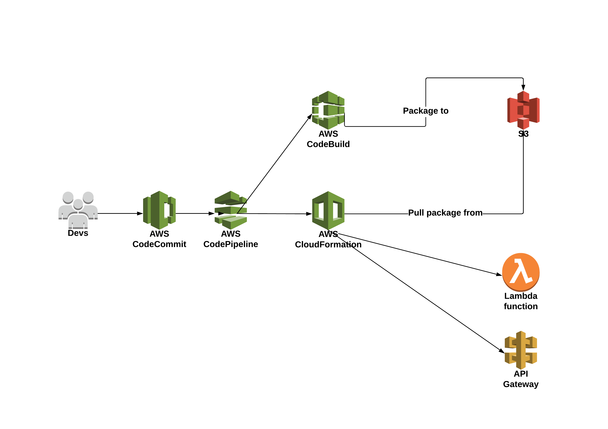

- [Overview](#overview)
- [Hands On](#hands-on)
    - [Logging in to AWS Console](#logging-in-to-aws-console)
    - [Creating the Pipeline](#creating-the-pipeline)
    - [Define the Source](#define-the-source)
    - [Define the Build](#define-the-build)
    - [Observe the failure](#observe-the-failure)
    - [Diagnose the build](#diagnose-the-build)
    - [Fix the build!](#fix-the-build)
    - [Re-run the pipeline](#re-run-the-pipeline)
    - [Add a new stage](#add-a-new-stage)
    - [Add a generate changeset action](#add-a-generate-changeset-action)
    - [Add an execute changeset action](#add-an-execute-changeset-action)
    - [Re-run the pipeline again](#re-run-the-pipeline-again)
    - [This is what success looks like!](#this-is-what-success-looks-like)
    - [Verify the deployment](#verify-the-deployment)
    - [Commit a change!](#commit-a-change)
    - [Verify the change!](#verify-the-change)
- [Additional Features](#additional-features)
- [Conclusion](#conclusion)
- [One more thing...](#one-more-thing)
- [Resources](#resources)

# Overview
Serverless is fast becoming the new default compute model for many software projects. The attractive pay as you go pricing model, rapid scaling and reduced ops overhead are very compelling advantages to any organisation shipping software.

While applications are moving to this new compute model, we're often still left with some traditional infrastructure in the form of build servers and nodes. This remains a burden for ops due to having to perform OS patching, build server updates and managing fleets of build nodes as well as monitoring for performance and right-sizing both server and build nodes on an ongoing basis. This leaves also a potential single point of failure where build servers are shared amongst different services being deployed - downtime of the server/nodes can mean delays in shipping. 

In this playground we're going to remove some of that burden by creating a serverless CI/CD pipeline on AWS using CodePipeline, CodeBuild and CloudFormation. This pipeline will be deploying a simple nodejs express application to lambda.

# Hands On

### Logging in to AWS Console
You can skip this section if you are using your own AWS account and have appropriate IAM access (detailed in addendum)

First we need to login to the console (credentials provided separately) - also ensure that we are in the eu-west-1 region.
https://ecsd-training.signin.aws.amazon.com/console

The user that we logged into won't have many permissions at this stage so we need to assume an appropriate role. Follow this link in order to do that

https://signin.aws.amazon.com/switchrole?roleName=pg23meetuprole&account=ecsd-training

Just click the "Switch Role" button to continue back to the console

Also switch your region to Ireland (eu-west-1), the default setup assumes this.

You should now see an indicator in the top right showing that you are currently assuming a role.

### Creating the pipeline

Next we need to navigate to the CodePipeline user interface.

Click the "Create Pipeline" button. If there are no pipelines listed you'll see a getting started screen instead so just click "Get started" to get to the next step

You now need to give your pipeline a name - this needs to be unique so try and follow convention e.g. firstnamelastinitial-pg23-pipeline (e.g. paulf-pg23-pipeline)

Click the "Next Step" button to continue

### Define the source

The first step in our pipeline is to grab our source code. In our case this is provided in a codecommit repository but other options are available for github and AWS S3. The branch we'll be deploying is the master branch.

If you are using your own account then you should use the contents of the repository https://github.com/ecsdigital/devopsplayground23-app - push this into your own CodeCommit repository and simply substitute the repository name in the steps here, the easiest way I've found is to checkout that repo, add a remote and push to your new remote repo.

Choose CodeCommit.

Pick the repository "pg23repo" and the branch master

Leave the "Change detection options" at their default - for CodeCommit and s3 this will use CloudWatch events to detect changes in order to trigger the pipeline, github will use webhooks.

Click the "Next Step" button to continue

### Define the Build

Next you need to pick your build provider. This can be a number of different options (some are not shown in the drop down, such as teamcity as these can be defined if you create your codebuild configuration using cloudformation), but for our purposes we're going to use CodeBuild.

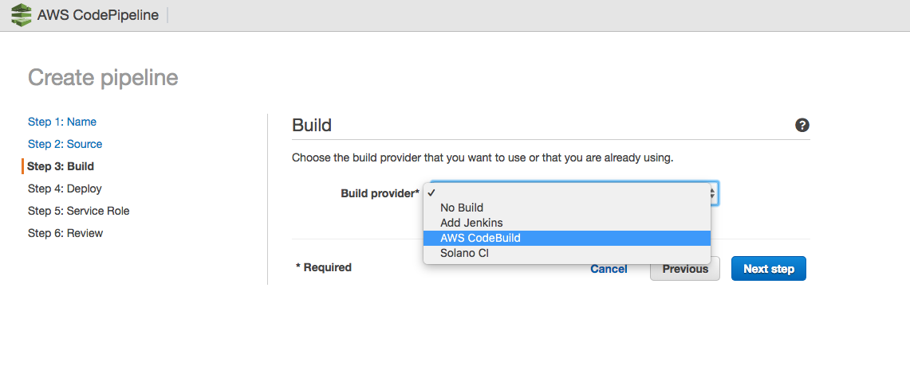

A number of additional fields will now appear which will need to be populated in order to create our codebuild configuration.

Firstly we want to "Create a new build project" and fill out the name field

Next we need to define the build environment. This can be achieved by either using an AWS provided CodeBuild container or by specifying a docker image of your choosing from either Amazon ECR or another docker repository.

We are going to use a standard linux ubuntu image with the nodejs10 environment.

The build specification defines the steps and commands you need to run in order to perform the build (e.g. npm install) as well as defining which artifacts are output from the process to be consumed by subsequent pipeline stages. You can feed parameters into the build spec by using environment variables which are injected into the container at runtime.

For more information on the buildspec see https://docs.aws.amazon.com/codebuild/latest/userguide/build-spec-ref.html

We have provided the buildspec for the project so just leave the "Use the buildspec.yml in the source code root directory" selected, all we're doing in the buildspec is validating and packaging a cloudformation template. 

Also leave the Cache set to "No cache".

Scroll down to the AWS CodeBuild service role section.

You can choose to either create an IAM role for this build project or re-use an existing one. At the time of writing if you re-use an existing one you can only do so 9 times as each time you re-use it will add an additional policy to the existing role and there's a limit of 10.

For this demo choose "Create a service role in your account", a sensible default name should already be populated but keep note of it for later as we may need additional permissions applied to that role in order to complete the build

No VPC is required for this particular build but if for example you wanted to update the database schema of an RDS instance in a VPC you would need to configure this.

The advanced section we won't be altering but worth talking through some of the options there.

Timeout - How long before you consider your build dead in the water. This is important to reduce cost, set it to something reasonable - too large and you may incur additional cost if a build stalls, too short and your builds may become intermittent especially where access to public artifcats is required (e.g. npm).

Privileged - If you are building docker images using CodeBuild then you need this. Often the use case is that CodeBuild will build and push a docker image and then that is rolled out to ECS using Cloudformation to replace the image on the service.

Compute Type - this determines the performance level of your container and also your cost per build minute.

Environment Variables - these are the variables available within your buildspec execution so if you need to parameterise your build you'd do it in this way.

Click "Save build project". This takes a few seconds as it also has to create the service role.

When creation is complete, hit the "Next step" button

### Skip deployment for now

For now select No Deployment - we'll come back and add this step later.

Click "Next step"

### Select a service role

CodePipeline requires a role in order to perform actions. You can either create a new role which will apply a default set of permissions or assume an existing one.

Select the existing "pg23-codepipeline-role" for this example

The minimum set of permissions required by the codepipeline role and how you define a custom role is outlined in aws documentation which can be found here https://docs.aws.amazon.com/codepipeline/latest/userguide/how-to-custom-role.html

Click "Next step" to proceed.

### Review the pipeline

The final stage is to review the pipeline settings.

Once you're happy with the settings, click "Create Pipeline"

Your build should now run.

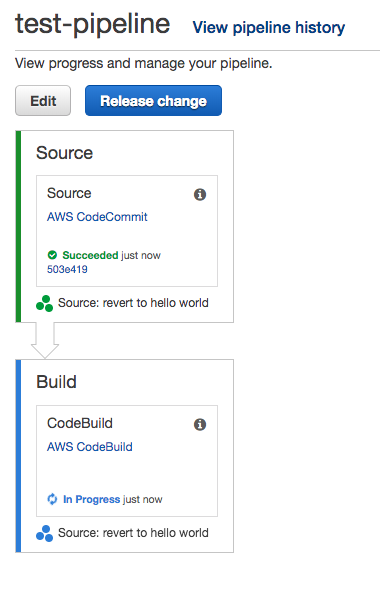

### Observe the failure

The build will fail!

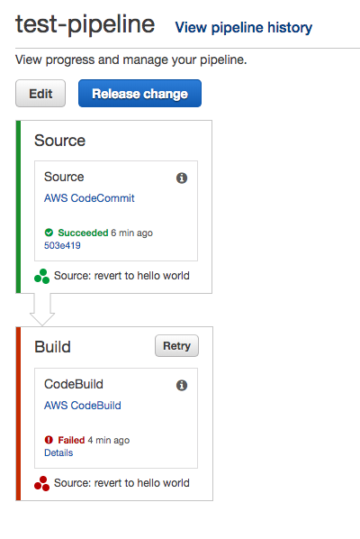

### Diagnose the build

To fix the build we need to know what went wrong.

In the failed build step, click on the details link.

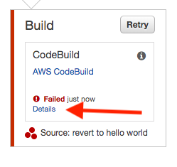

And then click the "Link to execution details".

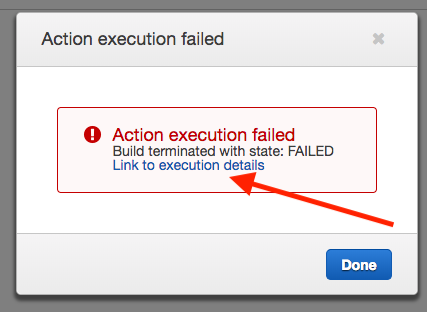

This will take us to the codebuild history for that execution. You will see in the build logs that we are missing a permission for PutObject on S3. This permission needs to be assigned to the CodeBuild role defined earlier.

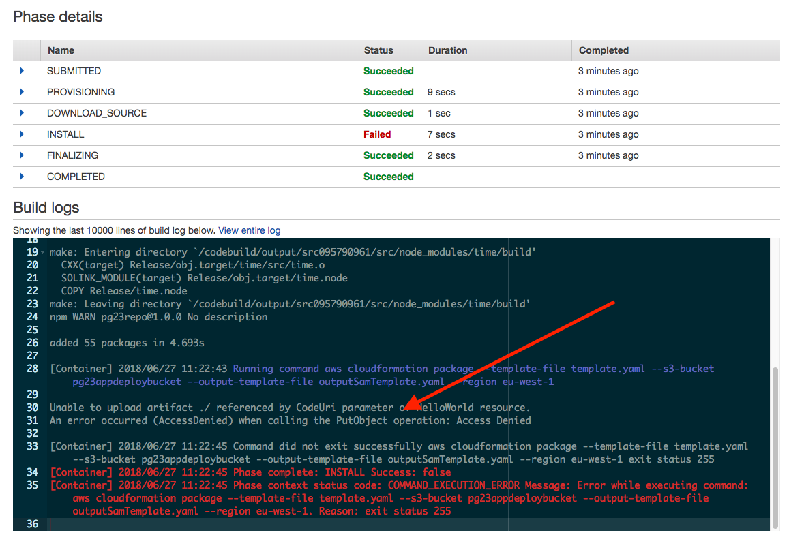

### Fix the build

Navigate to the IAM user interface.

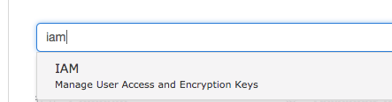

Select Roles on the left and fine the role you created for your CodeBuild configuration.

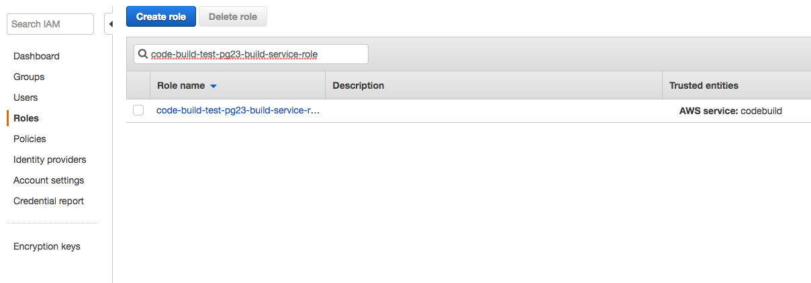

Click on the role link to get to the details of the role

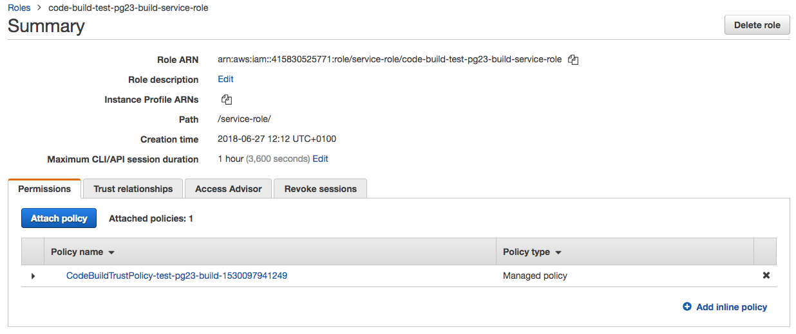

Click the "Attach Policy" button.

Type "S3" in the search box.

For this demo let's just assign "AmazonS3FullAccess" - in a real environment you'd define an appropriate policy for your bucket for least privilege. Select the "AmazonS3FullAccess" role by clicking the checkbox to its left.

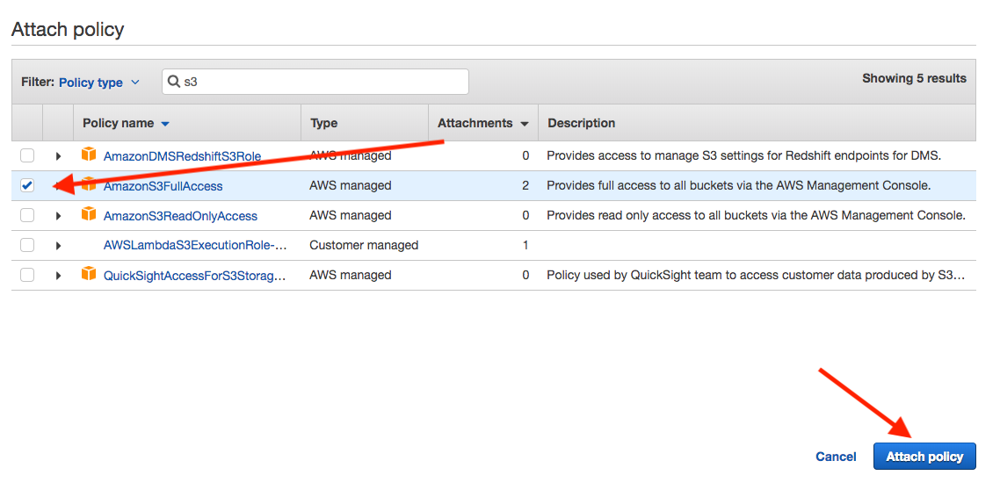

Click the "Attach Policy" button down the bottom right.

Observe that the Permissions tab now lists "AmazonS3FullAccess" in addition to existing policies.

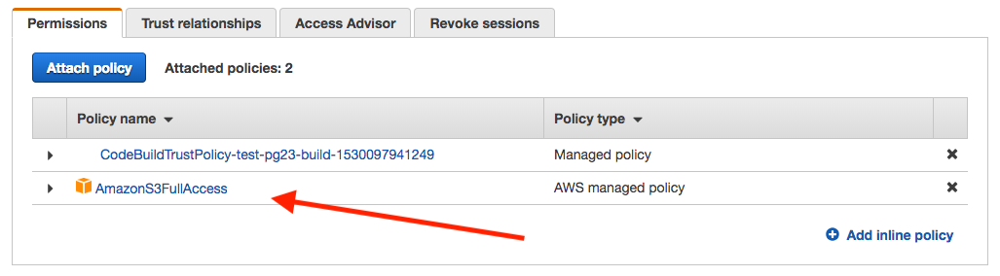

### Re-run the pipeline

Go back to your pipeline and click the "Release" button. This time the pipeline should succeed and we are ready to define our deployment steps!

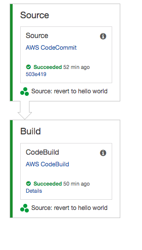

SUCCESS!

Ok so we've verified that the cloudformation template is valid and packaged up for deployment. We could add steps in here to perform unit tests, linting, static analysis etc here but let's try and deploy our application.

### Add a new stage

Deployment of a SAM template needs to consist of two steps as CloudFormation stack creation currently does not support template transforms. 

We instead need to generate a change set and then apply the change set to a new or existing CloudFormation stack.

This will require two pipeline actions.

First, lets add a new stage to the pipeline

In your pipeline, click the "Edit" button.

You will see the UI change to show additional controls which allow you to modify your pipeline's workflow.

Next you should click the +Stage button below the build stage as highlighted in the image. Give the stage a name and we can proceed to creating the action.

### Add a generate changeset action

The first action we need is one which takes the output of our build (the packaged sam template), and generates a change set for our cloudformation stack.

On the stage click the + Action button. A pane should appear to the right, in this pane choose Deploy as the Action Category

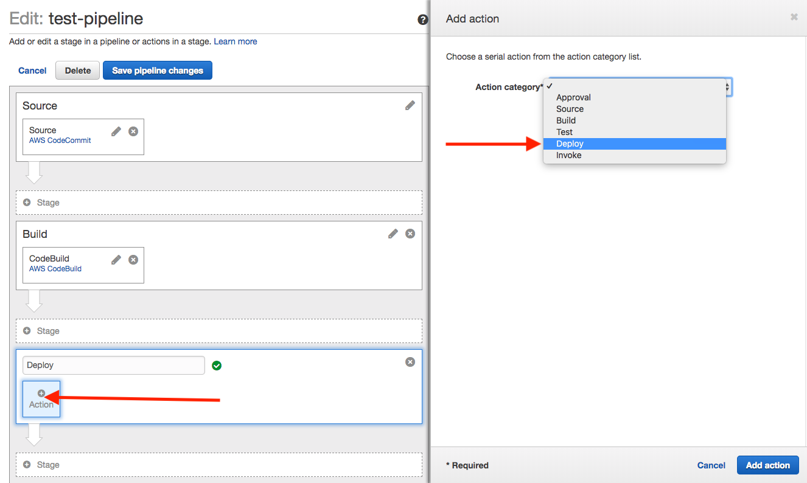

Give the action a name and select AWS CloudFormation as the Deployment Provider

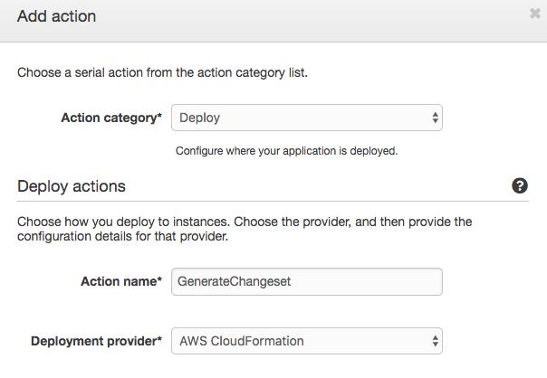

In the next section, select Action Mode "Create or replace a change set".

Set a stack name.

Set a change set name.

For the template you need to refer to a previous build output, in our case that will be the artifact MyAppBuild and the template output.yaml so as the Template you specify MyAppBuilc::output.yaml

Template configuration can be left blank

Select CAPABILITY_IAM in the capabilities field.

And finally select the pre-configured role pg23-cloudformation-role - this is the role assumed by CloudFormation when deploying the app.

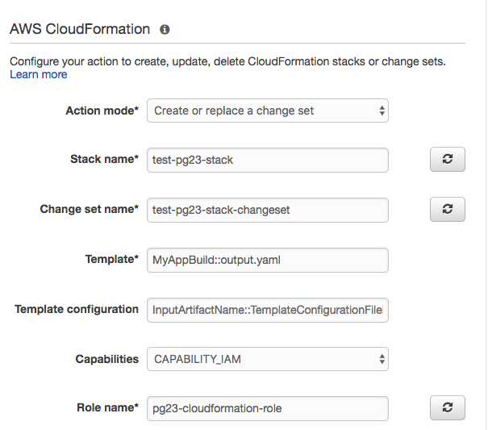

The advanced section allows you to define parameter overrids for your CloudFormation deployment but that is not necessary for our example.

In Input artifacts 1, specify MyAppBuild - this tells the action to copy the artifacts from the CodeBuild section.

We don't require any output artifacts, but these would be used to pass along to other build steps if required.

Click Add Action to complete.

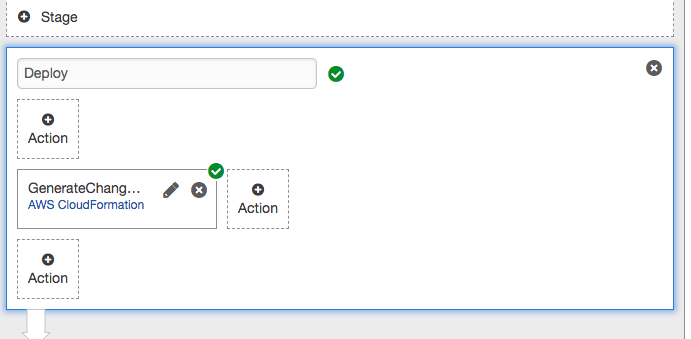

### Add an execute changeset action

As before, add another action under the GenerateChangeset one to indicate you want it to happen afterwards.

Again, give the action a name and select AWS CloudFormation as the provider.

Action mode needs to be set to Execute a change set.

The Stack name needs to match the one from the previous action

The change set name also needs to match the one from the previous action.

Specify MyAppBuild as the input artifact.

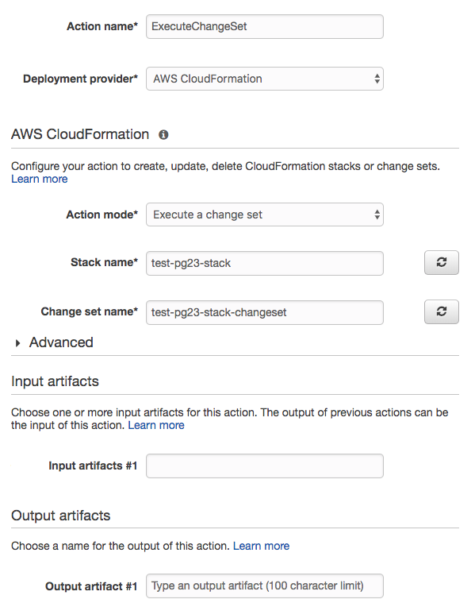

Now click "Save pipeline changes"

Your pipeline should now look like follows:-

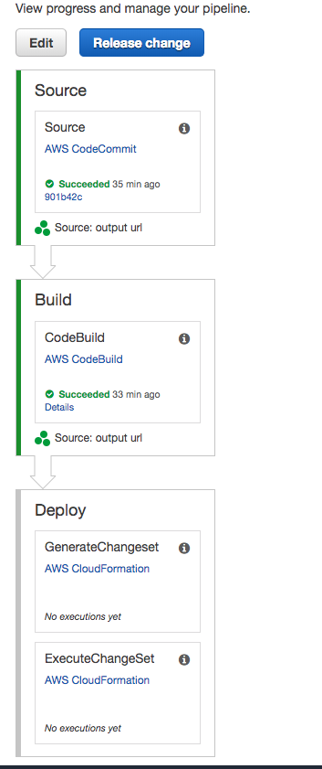

### Re-run the pipeline again

Click "Release change" to run the pipeline again with the deployment steps now defined.

If things are going well, the build should pass then on the CloudFormation list you should observe a new stack being created and reviewed.

### This is what success looks like!

If everything goes to plan the pipeline should complete as follows:-

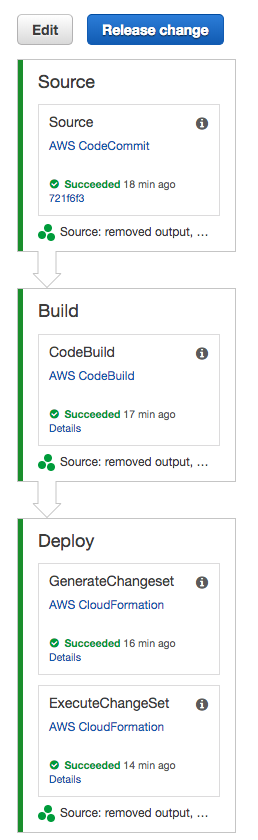

### Verify the deployment

So we're deployed! We now have an API we can hit, but need to first find the endpoint. Hit the details link on the ExecuteChangeSet task to goto the resultant CloudFormation build.

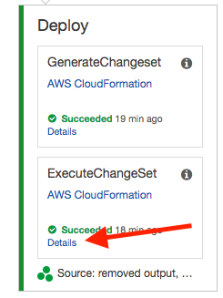

Click the Resources drop down and click on the link to the ServerlessRestApi

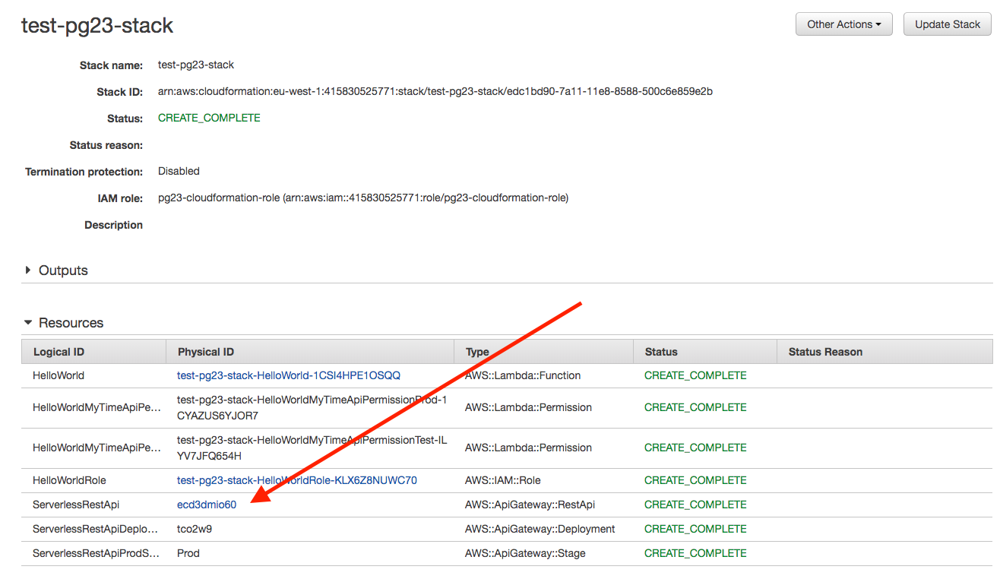

This will take you to the API gateway console.

Click on the gateway which is named similar to your CloudFormation stack

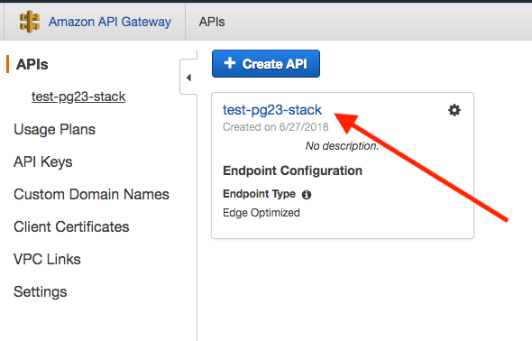

Then click Stages and Prod, the url should appear in a pane to the right.

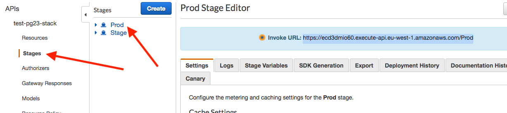

If you open this url in another tab you'll see the result of the request to the lambda function hosted behind that api.

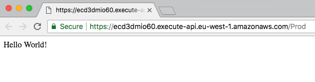

Result!

### Commit a change

Lets make a change to the app. In the interactive session I'll merge a pull request, but if doing this on your own go ahead and make some changes to the app.js file so that something obvious is different.

When merging back / pushing the change to master, your build pipeline should begin to run again.

### Verify the change

Once the build has completed, refresh the browser tab that you made the request to your api with. Hopefully the change will be reflected in the result.

# Additional Features

These are some of the features available and worth being aware of at the time of writing:-

## CodePipeline

Pipelines are not restricted to just one sequence of events. You can also have actions which run in parallel.

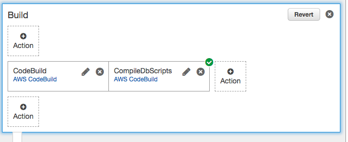

Out of the box providers surfaced in the UI are currently:

- Source Providers:
    - CodeCommit (AWS git implementation)
    - Github integration via webhooks and oauth tokens.
    - Amazon S3

- Build Providers:
    - CodeBuild
    - Jenkins (https://docs.aws.amazon.com/codepipeline/latest/userguide/tutorials-four-stage-pipeline.html?icmpid=docs_acp_console#tutorials-four-stage-pipeline-prerequisites)
    - Solano CI

- Deployment Providers:
    - Amazon ECS (Deploy to existing ecs/eks/fargate cluster)
    - AWS CloudFormation (featured here)
    - AWS CodeDeploy
    - AWS Elastic Beanstalk

Other providers are available such as TeamCity. These are implemented as custom actions.

- Additional Action Types:
    - Approval Actions (manually prompt a user to approve a build, use in conjunction with SNS for notification via email etc)
    - Test (Jenkins, CodeBuild, BlazeMeter, Ghost Inspector UI Testing, Nouvola, Runscope API Monitoring).
    - Invoke Lambda allows you to do custom actions during stages

CodePipeline is also extensible through custom actions and providers(https://docs.aws.amazon.com/codepipeline/latest/userguide/actions-create-custom-action.html)

## CodeBuild

Support of Linux/Windows containers for builds.

Custom Docker images can be used to reduce build time by installing necessary dependencies, or depencencies which are not available on the amazon image. Optimized images can reduce the time and therefore cost of builds.

## CloudFormation

Bread and butter of AWS automation. Worthy of a topic in itself. The entire build pipeline itself can be provisioned using CloudFormation - I'll follow up later with an example on this, but this would allow you to version control your release process separately from your application build + deployment code.

# Conclusion

So now we have a pipeline which can continuously deploy changes from our master branch to our deployment environment. 

Other additions we can make to this pipeline include additional stages (such as uat), manual approval (requiring human intervention in order to continue) as well as other actions such as running tests.

So hopefully now you have an idea of some of the things CodePipeline, CodeBuild and CloudFormation are capable of and have an appetite to explore further functionality.

# One more thing

As a sidenote, CodePipeline and CodeBuild also generate events which can be consumed and fed into CloudWatch as metrics. This can be used to build dashboards showing the performance of your pipeline and development process. This can be a powerful tool in diagnosing issues with your SDLC by examining the various metrics with regards to feedback, failure and deployment rate.

This dashboard was borrowed from Stelligent

https://stelligent.com/2017/11/16/codepipeline-dashboard/

The code can be found here: https://github.com/stelligent/pipeline-dashboard

What interesting metrics can you pick out of your pipeline?

# Resources

### CodePipeline

Product Details
https://aws.amazon.com/codepipeline/details/

Documentation
https://docs.aws.amazon.com/codepipeline/latest/userguide/welcome.html

CodePipeline custom role
https://docs.aws.amazon.com/codepipeline/latest/userguide/how-to-custom-role.html

CodePipeline custom actions
https://docs.aws.amazon.com/codepipeline/latest/userguide/actions-create-custom-action.html

TeamCity integration
https://aws.amazon.com/blogs/devops/building-end-to-end-continuous-delivery-and-deployment-pipelines-in-aws-and-teamcity/

### CodeBuild

Product Details
https://aws.amazon.com/codebuild/details/

Documentation
https://docs.aws.amazon.com/codebuild/latest/userguide/welcome.html

CodeBuild custom role
https://docs.aws.amazon.com/codebuild/latest/userguide/setting-up.html#setting-up-service-role

### CloudFormation

Product Details
https://aws.amazon.com/cloudformation/details/

Documentation
https://docs.aws.amazon.com/AWSCloudFormation/latest/UserGuide/Welcome.html

### CodeCommit

Product Details
https://aws.amazon.com/codecommit/details/

Documentation
https://docs.aws.amazon.com/codecommit/latest/userguide/welcome.html

### Lambda

Product Details
https://aws.amazon.com/lambda/

Documentation
https://docs.aws.amazon.com/lambda/latest/dg/welcome.html

### Serverless Application Model

Deploying lambda-based applications
https://docs.aws.amazon.com/lambda/latest/dg/deploying-lambda-apps.html

### Stelligent Codepipeline Dashboards
https://stelligent.com/2017/11/16/codepipeline-dashboard/

https://github.com/stelligent/pipeline-dashboard

